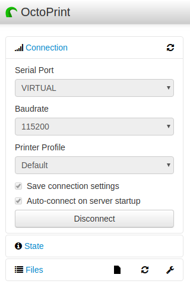
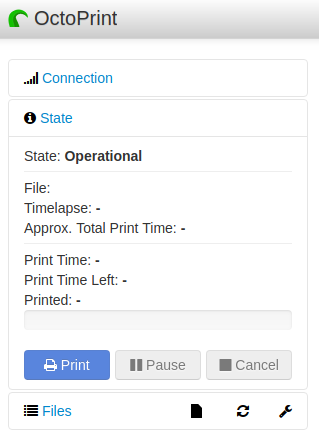
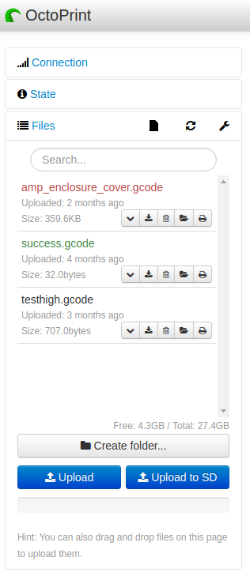

## Sidebar

### Connection

* Serial Port: The port your printer is connected to. On *nix systems this may be /dev/ttyUSBx and on windows this would be COMx (where x is a number). In this screenshot we're connected to a virtual printer included with OctoPrint for development purposes. This does not reflect an actual connection to a real printer.
* Baudrate: This is the serial speed your printer's firmware expects to communicate at, this setting *must* match the setting in your printer's firmware. Typical values are 115200 and 250000. 
* Printer Profile: You can have multiple profiles for different printers, but only one printer and profile can be active at any given time for a  particular OctoPrint instance.
* Save Connection Settings: This will save the settings entered here upon a successful connection.
* Auto-Connect On Startup: This will have OctoPrint attempt to automatically connect to your printer as soon as it starts up.
* Connect / Disconnect Button: This button displays either ``Connect`` or ``Disconnect`` based on whether or not OctoPrint is connected to a printer. Clicking on this button will do as the currently displayed text suggests, either connect to a printer using the displayed settings, or disconnect from the currently connected device.

*Manually setting both the baud and port will result in the quickest and most reliable connecting during startup, if either are set to "Auto" it may take a significant amount of time before OctoPrint detects the correct settings.*

*Upon successful connection, the connection sidebar accordion will automatically collapse itself to save space.*

---------------

### State

* State: Here's where you'll see the stus of your printer, Operational, Offline, Printing, etc...
* File: This will display the currently loaded file
* Timelapse: This will show the current timelapse mode setting, and interval if timed mode is active.
* Approx. Total Print Time: This is an estimated total print time of the currently loaded file based on a static analysis of the current file.
* Print Time: This is how long the current print job has been going for.
* Print Time Left: This is how long OctoPrint thinks is left on the current job, unlike the previous approximate estimation, this value is constantly re-calculated based on previous layers, previous successful prints of the same file, and other factors.
* Printed: How much of the current file has been printed.

*Note on print times: There are a lot of factors that can throw OctoPrint's estimation off. Maximum speed and acceleration set in your firmware can mean OctoPrint's estimates may be off by a few seconds, or a few days. Slicers that include print time estimates usually try to take your settings into account, OctoPrint is unable to do this since it is not slicing the files itself, and does not have access to these settings.*

* Print, Pause, Cancel Buttons: Control your prints with these. 

*Pausing / Cancelling a print may not immediately stop the print (say in the event you see your filament has run out) as your printer has a buffer inside it that it may have to run through before the print actually stops.*

--------------------

### Files

This is where your uploaded files will be displayed. 

#### Title bar icons are: SD card operations, Refresh, and Settings.

* SD Card Operations: Refresh or release your SD card. This is the SD card attached directly to your printer.
* Refresh: Refresh the file list if for whatever reason an upload doesn't show up.
* Settings: Change various options for the file list such as sorting options and the types of files to display

#### File name colour

* Red: Print Failure, if a print fails or is cancelled the file's name will be displayed in red.
* Green: Print Success, if a print is completed 100% successfully, the file name will turn green.
* Black: This is the default file name colour for newly uploaded files that haven't been printed yet.

#### File Buttons: Expand, Download, Delete, Load, Load and Print

* Expand: Expands the file info to view extra info
* Download: Downloads the file to your local PC
* Delete: Delete the file from OctoPrint's storage
* Load: Loads the file, can be useful if you wish to view the file in OctoPrint's gcode viewer prior to printing.
* Load and Print: Loads the file and immediately starts printing. More useful if you slice on a PC and preview the gcode prior to uploading to OctoPrint.

#### Operation Buttons

* Create Folder Button: For creating a folder to store files in, for organising your files by project name or type, etc.
* Upload Button: This uploads your file to OctoPrint's server storage. This might be a spinning platter hard drive if OctoPrint is installed on a PC, or the SD card your Raspberry Pi OS is installed on.
* Upload To SD Button: This will attempt to upload your file to your printer's internal SD card if it has one.

*Upload to SD may be confusing for Raspberry Pi users as they use an SD card for their "hard drive". OctoPrint is designed to run on multiple hardware platforms where the server's storage may be a spinning platter hard drive and thus slightly less confusing of a name. Uploading to an SD card attached to your printer can be extremely slow. If you wish to use an SD card attached to your printer, the most reliable method is to copy the gcode to the SD card using a card reader in your PC and then insert it into your printer.*