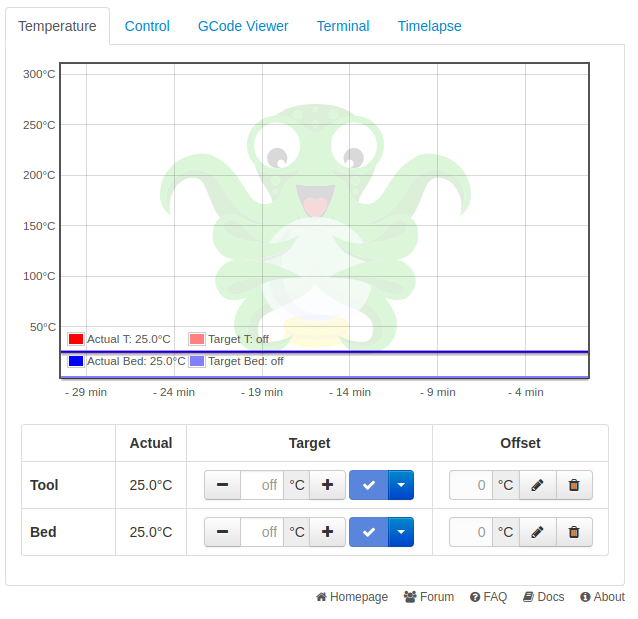
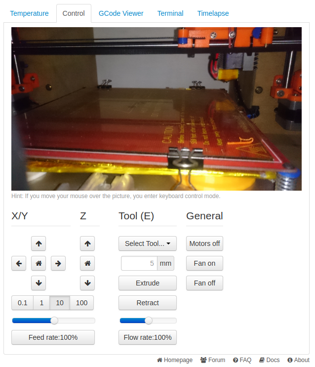
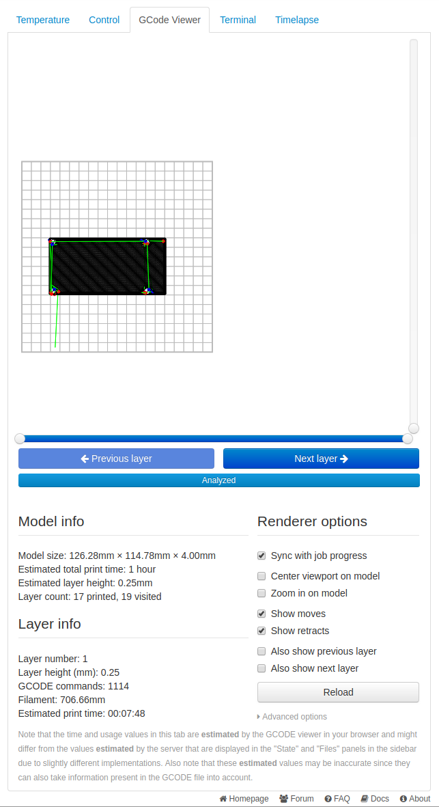
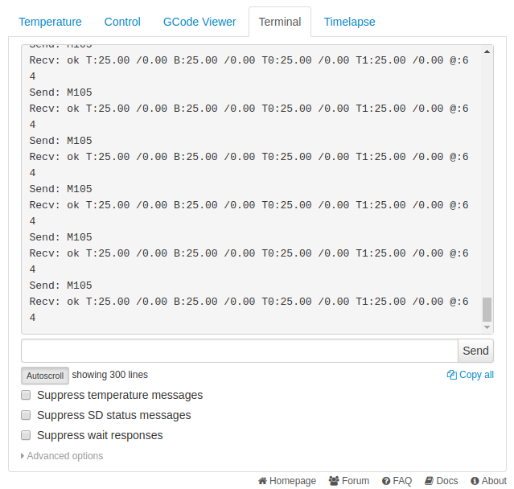
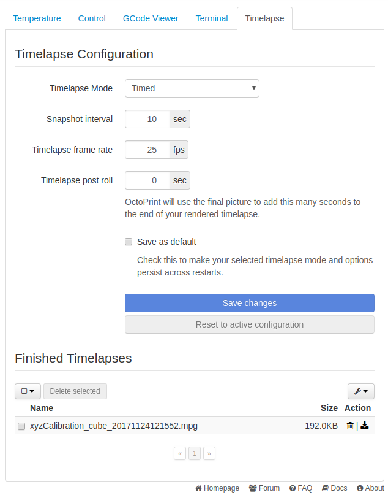

## Tabs

Most of the stuff in the tabs section is pretty well documented in the UI itself and fairly obvious what things do but here's a few things that might not be quite so obvious.

### Temperature 

* The Graph: Shows a history of temperatures over time. Useful for seeing if your printer's temperatures fluctuate due to room temperature changes, cooling fans, etc, and whether your heaters can keep up or whether a PID tune is in order.
* Controls: This is where you can see and set your temperatures for the hot end and bed. An offset is also provided if you wish your hot end or bed to be hotter or colder than the temperatures set inside your gcode.

*To turn off the hot end or bed heater, use the drop down menu and select* ``Off`` *or enter* ``0`` *(zero) for its temperature.*

-----------

### Control

#### Webcam

This is where you'll see a webcam feed if you have a web cam configured.

#### Movement

* The Arrow Buttons: These do not indicate direction, but are representitive of positive and negative movement. The movement arrows that point "up" and "right" indicate positive movement, while the "down" and "left" pointing arrow buttons indicate negative movement. Pressing these buttons may cause your printer to move in what appears to be the opposite direction relative to the buttons. This is completely normal as long as your printer's axis moves in the positive direction when you press a positive movement direction button, and negative when you press the negative direction buttons. You can also invert these controls individually for X, Y, and Z in the printer profile in OctoPrint's settings if you wish.
* House Icon: The buttons with a little house icon is the "home" button and should cause your printer's axes to move towards the limit switches.
* Distance Buttons: These dictate how far the axis will move when you press the direction buttons. Measurements are in millimetres.
* Feed Rate Slider + Button: This will change the printer's movement speed multiplier. Useful for fine tuning your movement speed if you accidentally slice with a movement speed that is slightly too slow / fast.

#### Tools

* Tool Selection: If your printer has more than one tool head, you can select which one to control.
* Extrude / Retract: This will tell the printer to extrude or retract the amount of filament set.
* Flow Rate Slider + Button: You can use this if you observe your printer over or under extruding during a print. Ideally this value should always be left at 100%, if you need to change this for every print, you may need to re-calibrate your e-steps or slicer's extrusion rate multiplier.

*The feed rate and flow rate sliders do not synchronize across browsers and will reset to 100% on browser refresh. This is because most 3d printers don't output much in the way of information that OctoPrint can use to set these values in the UI, or to synchronize the value across sessions.*

#### General

* Motors Off: Sends the ``M18`` command to the printer to turn off the motors (if supported by your firmware)
* Fan On/Off: Turns the *parts cooling fan* on or off. This is the fan that cools down the plastic that comes out of your hot end. Any fan on your hot end's heatsink should never be turned off during a print.

*Firmware support for* ``M18`` *can differ, for example Repetier Firmware does not support* ``M18`` *but instead uses* ``M84`` *and so in some cases this  button may not function on your printer.*

----------------

### Gcode Viewer

This will give you a top-down preview of the file that is currently loaded into OctoPrint. There's also some information listed about the file that is currently loaded.

*When the viewer is synced to a print job, the viewer may not display exactly what the printer is doing due to 3d printers containing a small buffer. The gcode viewer may be slightly ahead of what your printer is actually printing.*

------------

### Terminal

* Console output: This is where you can see the gcodes being sent to your printer, and any responses it may give back to OctoPrint. Mostly for diagnostic purposes in the case of errors and issues.
* Entry box: This is where you can enter manual gcode commands such as the command to start a PID auto tune, or to read / set EEPROM settings on your printer. 

*This is* **only** *the serial communication between OctoPrint and your printer. You cannot use it to perform command line operations such as those available through an SSH session.*

--------------

### Timelapse

This is where you can set the mode (timed or z value based) to dictate how OctoPrint determines when to take each picture. Timed will take a picture every X seconds, On Z Change will take a photo every time the value of Z changes (so every new layer).

#### Mode: Timed
* Interval: Time between each snapshot when in timed mode
* Framerate: FPS of your final video
* Timelapse post roll: How many seconds OctoPrint will capture after your print is complete. This is handy so your video doesn't just suddenly stop immediately after the print is finished.

#### Mode: On Z Change
* Minimum Interval: Minimum time between snapshots to prevent "vase mode" prints from taking excessive amounts of images.
* Retraction z-hop: To differentiate between a Z hop for a travel movement on a single layer and an actual layer change, to prevent z-hops on travel movement from triggering a snapshot.

#### Common

* Save as default: This will write your configuration to OctoPrint's configuration file. Saving without this checked will only save the settings for the current session, rebooting OctoPrint will revert back to the previous settings. Saving with this checked will ensure OctoPrint always uses the settings as the defaults on startup.
* Save changes button: Saves the current settings (either temporary or as defaults if the option is checked to do so)
* Reset to active configuration: Reverts the current changes to the previously saved settings if you change something and wish to revert.

#### Completed timelapses

This is where you can manage your finished timelapse videos. You can download and delete them either individually, or use the options to check all and mass delete them if you have a lot of old timelapse videos.