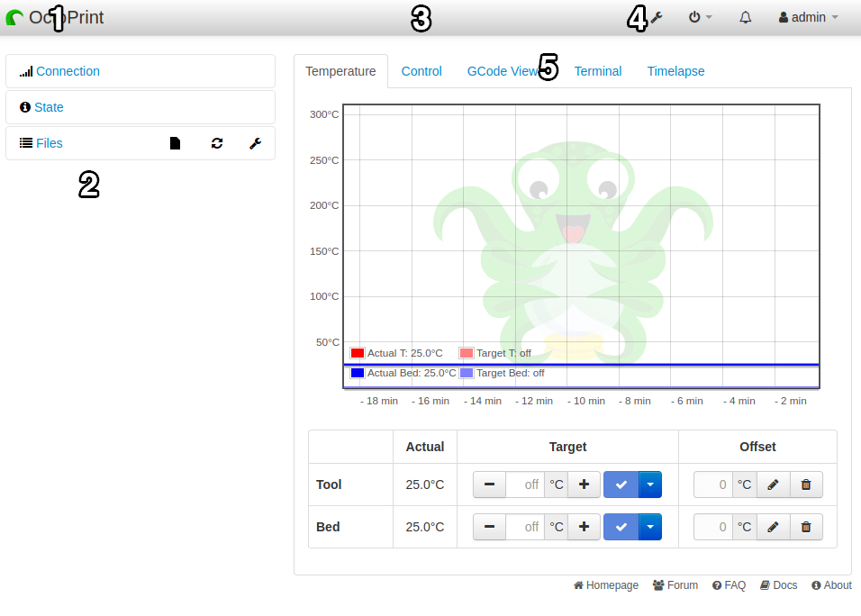

## Main UI

1. Name: You can set a name in OctoPrint's "Appearance" setting that will appear here to make it easier to identify if you have multiple OctoPrint devices.
2. Side Bar: This is where you will find printer connection settings, uploaded files, and the state of your printer's current job (if there is one).
3. Nav bar plugins section: This is where plugins can place themselves to display information.
4. Nav bar menu: From left to right - Settings - System menu - Notifications - Logged in user. The system menu is where you can find all the shutdown and restart options for OctoPrint and your server.
5. Tabs: The different tabs contain the various sections you can use to monitor and control your printer.

*There are links down the very bottom of the page, under the tabs, to the (somewhat technical) documentation, the FAQ, discussion forum, and issue tracker. If you need help, check the FAQ, and the documentation, and if all else fails you can seek help on the discussion forum.*